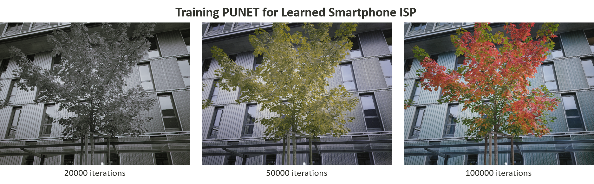
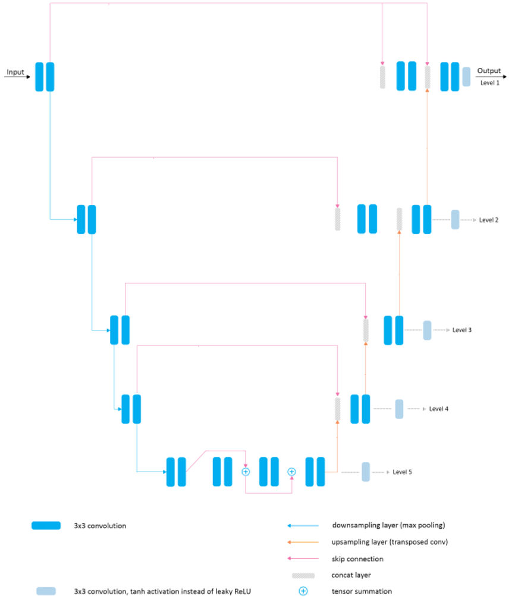
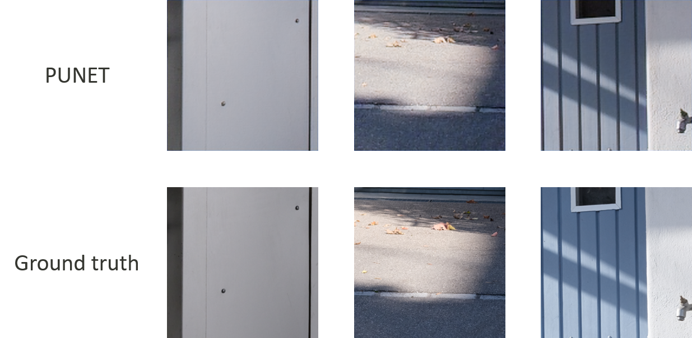

# Deep Learning for Smartphone ISP [](https://www.mediatek.com/)



## Overview 

[**[Challenge Report Paper]**](https://arxiv.org/abs/2105.07809) [**[Challenge Website]**](https://competitions.codalab.org/competitions/28054) [**[Workshop Website]**](http://ai-benchmark.com/workshops/mai/2021/)

This repository provides the implementation of the baseline model, **PUNET**, for the [***Learned Smartphone ISP*** Challenge](https://competitions.codalab.org/competitions/28054) in [*Mobile AI (MAI) Workshop @ CVPR 2021*](http://ai-benchmark.com/workshops/mai/2021/). The model is trained to convert **RAW Bayer data** obtained directly from mobile camera sensor into photos captured with a professional *Fujifilm DSLR* camera, thus replacing the entire hand-crafted ISP camera pipeline. The provided pre-trained PUNET model can be used to generate full-resolution **12MP photos** from RAW image files captured using the *Sony IMX586* camera sensor. PUNET is a UNet-like architecture modified from PyNET and serve as an extension to the [PyNET](https://github.com/aiff22/PyNET) project.

### Contents:
- [Overview](#overview)
- [Prerequisites](#prerequisites)
- [Dataset and model preparation](#dataset-and-model-preparation)
- [Learned ISP Pipeline](#learned-isp-pipeline)
- [Training](#training)
  - [Start training](#start-training)
  - [Resume training](#resume-training)
- [Test/Inference](#testinference)
  - [Use the provided pre-trained model](#use-the-provided-pre-trained-model)
  - [Use the self-obtained model](#use-the-self-obtained-model)
- [Convert checkpoint to pb](#convert-checkpoint-to-pb)
- [Convert pb to tflite](#convert-pb-to-tflite)
- [TFLite inference](#tflite-inference)
  - [Desktop/Laptop](#desktop-laptop)
  - [Mobile](#mobile)
- [[Optional] Some useful tools](#optional-some-useful-tools)
- [Results](#results)
- [Folder structure (default)](#folder-structure-default)
- [Model optimization](#model-optimization)
- [Common FAQ](#common-faq)
- [Acknowledge](#acknowledge)
- [Citation](#citation)
- [License](#license)
- [Contact](#contact)

---
### Prerequisites

- Python: numpy, scipy, imageio and pillow packages
- [TensorFlow 1.15.0](https://www.tensorflow.org/install/) + [CUDA cuDNN](https://developer.nvidia.com/cudnn)
- GPU for training (e.g., Nvidia GeForce GTX 1080)

[[back]](#contents)
<br/>

---
### Dataset and model preparation

- Download Mediatek's pre-trained *PUNET* model and put it into `models/original/` folder.
- Download training data and extract it into `raw_images/train/` folder.    
- Download validation data and extract it into `raw_images/val/` folder.
- Download testing data and extract it into `raw_images/test/` folder.    
  <sub>The dataset folder (default name: `raw_images/`) should contain three subfolders: `train/`, `val/` and `test/`. </sub>
  <sub>Please find the download links to above files in **MAI'21 Learned Smartphone ISP Challenge** [website](https://competitions.codalab.org/competitions/28054) (registration needed). </sub>

- [Optional] Download pre-trained [VGG-19 model](https://polybox.ethz.ch/index.php/s/7z5bHNg5r5a0g7k) <sup>[Mirror](https://drive.google.com/file/d/0BwOLOmqkYj-jMGRwaUR2UjhSNDQ/view?usp=sharing)</sup> and put it into `vgg_pretrained/` folder.  
  <sub>The VGG model is used for one of the loss functions `loss_content` in the baseline, which takes the output of PUNET as the input. You are free to remove that loss (line 65-72 in `train_model.py`). This may affect the result PSNR, but won't affect the whole pipeline.</sub>

[[back]](#contents)
<br/>

---
### Learned ISP Pipeline

The whole pipeline of **Learned Smartphone ISP** has two main steps (assume the input resolution is `H x W`):
1. deBayer pre-processing (in [`load_dataset.py`](load_dataset.py)):
    * *Input*: RAW data [`H x W x 1`]
    * *Output*: deBayer RAW data [`(H/2) x (W/2) x 4`]  
    * You are free to modify the pre-processing method as long as the input & output shapes are kept.
2. PUNET model (in [`model.py`](model.py)): PUNET is a UNet-like architecture modified from [PyNET](https://github.com/aiff22/PyNET).
    * *Input*: deBayer RAW data [`(H/2) x (W/2) x 4`]
    * *Output*: RGB image [`H x W x 3`]
    * **[Important]** The submitted TFLite model to the [***Learned Smartphone ISP*** Challenge @ MAI 2021](https://competitions.codalab.org/competitions/28054) is required to have the same input & output shapes as PUNET. Please check the [challenge website](https://competitions.codalab.org/competitions/28054) for more details.



[[back]](#contents)
</br>

---
### Training

#### Start training
To train the model, use the following command:

```bash
python train_model.py
```

Optional parameters (and default values):

>```dataset_dir```: **```raw_images/```** &nbsp; - &nbsp; path to the folder with the dataset <br/>
>```model_dir```: **```models/```** &nbsp; - &nbsp; path to the folder with the model to be restored or saved <br/>
>```vgg_dir```: **```vgg_pretrained/imagenet-vgg-verydeep-19.mat```** &nbsp; - &nbsp; path to the pre-trained VGG-19 network <br/>
>```dslr_dir```: **```fujifilm/```** &nbsp; - &nbsp; path to the folder with the RGB data <br/>
>```phone_dir```: **```mediatek_raw/```** &nbsp; - &nbsp; path to the folder with the Raw data <br/>
>```arch```: **```punet```** &nbsp; - &nbsp; architecture name <br/>
>```num_maps_base```: **```16```** &nbsp; - &nbsp; base channel number (e.g. 8, 16, 32, etc.) <br/>
>```restore_iter```: **```None```** &nbsp; - &nbsp; iteration to restore <br/>
>```patch_w```: **```256```** &nbsp; - &nbsp; width of the training images <br/>
>```patch_h```: **```256```** &nbsp; - &nbsp; height of the training images <br/>
>```batch_size```: **```32```** &nbsp; - &nbsp; batch size [small values can lead to unstable training] <br/>
>```train_size```: **```5000```** &nbsp; - &nbsp; the number of training patches randomly loaded each 1000 iterations <br/>
>```learning_rate```: **```5e-5```** &nbsp; - &nbsp; learning rate <br/>
>```eval_step```: **```1000```** &nbsp; - &nbsp; each ```eval_step``` iterations the accuracy is computed and the model is saved <br/>
>```num_train_iters```: **```100000```** &nbsp; - &nbsp; the number of training iterations <br/>

</br>

Below we provide an example command used for training the PUNET model on the *Nvidia GeForce GTX 1080 GPU with 8GB of RAM*. 

```bash
CUDA_VISIBLE_DEVICES=0 python train_model.py \
  model_dir=models/punet_MAI/ arch=punet num_maps_base=16 \
  patch_w=256 patch_h=256 batch_size=32 \
  eval_step=1000 num_train_iters=100000
```

After training, the following files will be produced under `model_dir`:
>```checkpoint```                                 &nbsp; - &nbsp; contain all the checkpoint names <br/>
>```logs_[restore_iter]-[num_train_iters].txt```  &nbsp; - &nbsp; training log (including loss, PSNR, etc.) <br/>
>```[arch]_iteration_[iter].ckpt.data```          &nbsp; - &nbsp; part of checkpoint data for the model `[arch]_iteration_[iter]` <br/>
>```[arch]_iteration_[iter].ckpt.index```          &nbsp; - &nbsp; part of checkpoint data for the model `[arch]_iteration_[iter]` <br/>

#### Resume training
To resume training from `restore_iter`, use the command like follows:

```bash
CUDA_VISIBLE_DEVICES=0 python train_model.py \
  model_dir=models/punet_MAI/ arch=punet num_maps_base=16 \
  patch_w=256 patch_h=256 batch_size=32 \
  eval_step=1000 num_train_iters=110000 restore_iter=100000 
```

[[back]](#contents)
<br/>

---
### Test/Inference
`test_model.py` runs a model on testing images with the height=`img_h` and width=`img_w`. Here we use `img_h=1088` and `img_w=1920` as the example. If `save=True`, the protobuf (frozen graph) that corresponds to the testing image resolution will also be produced.

<br/>

#### Use the provided pre-trained model

To produce output images and protobuf using the pre-trained model, use the following command:

```bash
python test_model.py orig=True
```

<br/>

#### Use the self-obtained model

To produce output images and protobuf using the self-trained model, use the following command:

```bash
python test_model.py
```

Optional parameters (and default values):

>```dataset_dir```: **```raw_images/```** &nbsp; - &nbsp; path to the folder with the dataset <br/>
>```test_dir```: **```fujifilm_full_resolution/```** &nbsp; - &nbsp; path to the folder with the test data <br/>
>```model_dir```: **```models/```** &nbsp; - &nbsp; path to the folder with the models to be restored/loaded <br/>
>```result_dir```: **```results/```** &nbsp; - &nbsp; path to the folder with the produced outputs from the loaded model <br/>
>```arch```: **```punet```** &nbsp; - &nbsp; architecture name <br/>
>```num_maps_base```: **```16```** &nbsp; - &nbsp; base channel number (e.g. 8, 16, 32, etc.) <br/>
>```orig```: **```True```**, **```False```** &nbsp; - &nbsp; use the pre-trained model or not <br/>
>```restore_iter```: **```None```** &nbsp; - &nbsp; iteration to restore (when not specified with self-train model, the last saved model will be loaded)<br/>
>```img_h```: **```1088```** &nbsp; - &nbsp; width of the testing images <br/>
>```img_w```: **```1920```** &nbsp; - &nbsp; height of the testing images <br/>
>```use_gpu```: **```True```**,**```False```** &nbsp; - &nbsp; run the model on GPU or CPU <br/>
>```save```: **```True```** &nbsp; - &nbsp; save the loaded check point and protobuf (frozed graph) again <br/>
>```test_image```: **```True```** &nbsp; - &nbsp; run the loaded model on the test images. Can set as **```False```** if you only want to save models. <br/>

</br>

Below we provide an example command used for testing the model:

```bash
CUDA_VISIBLE_DEVICES=0 python test_model.py \
  test_dir=fujifilm_full_resolution/ model_dir=models/punet_MAI/ result_dir=results/full-resolution/ \
  arch=punet num_maps_base=16 orig=False restore_iter=98000 \
  img_h=1088 img_w=1920 use_gpu=True save=True test_image=True
```

After inference, the output images will be produced under `result_dir`.

**[Optional]** If `save=True`, the following files will be produced under `model_dir`:
>```[model_name].ckpt.meta```  &nbsp; - &nbsp; graph data for the model `model_name` <br/>
>```[model_name].pb```         &nbsp; - &nbsp; protobuf (frozen graph) for the model `model_name` <br/>
>```[model_name]/```           &nbsp; - &nbsp; a folder containing [Tensorboard](https://www.tensorflow.org/tensorboard) data for the model `model_name` <br/>

Notes: 
1. to export protobuf (frozen graph), the **output node name** needs to be specified. In this sample code, we use `output_l0` for PUNET. If you use a different name, please modify the argument for the function `utils.export_pb` (Line #111 in `test_model.py`). You can also use [Tensorboard](https://www.tensorflow.org/tensorboard) to check the output node name.
2. ***[Important]*** In the [***Learned Smartphone ISP*** Challenge](https://competitions.codalab.org/competitions/28054) in [*Mobile AI (MAI) Workshop @ CVPR 2021*](http://ai-benchmark.com/workshops/mai/2021/), you may need to use different models for different evaluation goals (i.e. quality and latency). Therefore, please specify different `img_h` and `img_w` for different evaluation goals. <br/>
    * *Example 1*: For evaluating PSNR for validation data (resolution: *256x256*) and generating processed images:
    ```bash
    CUDA_VISIBLE_DEVICES=0 python test_model.py \
      test_dir=mediatek_raw/ model_dir=models/punet_MAI/ result_dir=results/ \
      arch=punet num_maps_base=16 orig=False restore_iter=98000 \
      img_h=256 img_w=256 use_gpu=True save=True test_image=True
    ``` 
    * *Example 2*: For evaluating the inference latency (resolution: *1088x1920*) without generating any output images:
    ```bash
    CUDA_VISIBLE_DEVICES=0 python test_model.py \
      model_dir=models/punet_MAI/ \
      arch=punet num_maps_base=16 orig=False restore_iter=98000 \
      img_h=1088 img_w=1920 use_gpu=True save=True test_image=False
    ```

[[back]](#contents)
</br>

---
### Convert checkpoint to pb

`test_model.py` can produce protobuf automatically if `save=True`. 
If you want to directly convert the checkpoint model (including `.meta`, `.data`, and `.index`) to protobuf, we also provide `ckpt2pb.py` to do so.
The main arguments (and default values) are as follows:

>```--in_path```: **```models/punet_MAI/punet_iteration_100000.ckpt```**  &nbsp; - &nbsp; input checkpoint file (including `.meta`, `.data`, and `.index`) <br/>
>```--out_path```: **```models/punet_MAI/punet_iteration_100000.pb```**   &nbsp; - &nbsp; output protobuf file <br/>
>```--out_nodes```: **```output_l0```**                                   &nbsp; - &nbsp; output node name <br/>

Notes:
1. As mentioned earlier, the **output node name** needs to be specified. There are two ways to check the output node name:
    * check the graph in [Tensorboard](https://www.tensorflow.org/tensorboard).
    * directly specify the node name in the source code (e.g. use `tf.identity`).
2. `.meta` is necessary to convert a checkpoint to protobuf since it contains the important model information (e.g. architecture, input size, etc.).

Below we provide an example command:

```bash
python ckpt2pb.py \
  --in_path models/punet_MAI/punet_iteration_100000.ckpt \
  --out_path models/punet_MAI/punet_iteration_100000.pb \
  --out_nodes output_l0
```

[[back]](#contents)
</br>

---
### Convert pb to tflite

The last step is converting the frozen graph to TFLite so that the evaluation server can evaluate the performance on MediaTek devices. Please use the official Tensorflow function `tflite_convert`. The main arguments (and default values) are as follows:

>```graph_def_file```: **```models/original/punet_pretrained.pb```**  &nbsp; - &nbsp; input protobuf file <br/>
>```output_file```: **```models/original/punet_pretrained.tflite```** &nbsp; - &nbsp; output tflite file <br/>
>```input_shape```: **```1,544,960,4```**                           &nbsp; - &nbsp; the network input, which is after debayering/demosaicing. If the raw image shape is `(img_h, img_w, 1)`, `input_shape` should be `(img_h/2, img_w/2, 4)`. <br/>
>```input_arrays```: **```Placeholder```**                            &nbsp; - &nbsp; input node name (can be found in [Tensorboard](https://www.tensorflow.org/tensorboard), or specified in source codes) <br/>
>```output_arrays```: **```output_l0```**                             &nbsp; - &nbsp; output node name (can be found in [Tensorboard](https://www.tensorflow.org/tensorboard), or specified in source codes) <br/>

Below we provide an example command:

```bash
tflite_convert \
  --graph_def_file=models/punet_MAI/punet_iteration_100000.pb \
  --output_file=models/punet_MAI/punet_iteration_100000.tflite \
  --input_shape=1,544,960,4 \
  --input_arrays=Placeholder \
  --output_arrays=output_l0
```

***[Important]*** In the [***Learned Smartphone ISP*** Challenge](https://competitions.codalab.org/competitions/28054) in [*Mobile AI (MAI) Workshop @ CVPR 2021*](http://ai-benchmark.com/workshops/mai/2021/), participants are required to submit **TWO** TFLite models:
1. `model_none.tflite` (for evaluating the image quality): input shape `[1, None, None, 4]` and output shape `[1, None, None, 3]`.
2. `model.tflite` (for evaluating the inference latency): input shape `[1, 544, 960, 4]` and output shape `[1, 1088, 1920, 3]`. 

Feel free to use our provided bash script as well:
```bash
bash pb2tflite.sh
```
<sub>Note: `pb2tflite.sh` converts our provided pretrained model, not exactly the same as the above example commands. </sub>

[[back]](#contents)
</br>

---
### TFLite inference

#### Desktop/Laptop
`inference_tflite.py` can load the TFLite model and process a folder of images. The main argument (and default values) are as follows:

>```dataset_dir```: **```raw_images```**  &nbsp; - &nbsp; main folder for input images <br/>
>```dir_type```: **```test```**,**```val```**  &nbsp; - &nbsp; select validation or testing data <br/>
>```phone_dir```: **```mediatek_raw```**  &nbsp; - &nbsp; folder for input RAW images <br/>
>```dslr_dir```: **```None```**  &nbsp; - &nbsp; folder for corresponding ground truth <br/>
>```model_file```: **```models/original/punet_pretrained_small.tflite```**  &nbsp; - &nbsp; TFLite model <br/>
>```save_results```:  &nbsp; - &nbsp; save the processed images <br/>
>```save_dir```: **```results```**  &nbsp; - &nbsp; main folder for output images <br/>

Below we provide an example command:

```bash
python inference_tflite.py \
  --dir_type=test --phone_dir=mediatek_raw \
  --model_file=models/punet_MAI/punet_iteration_100000_input-256.tflite \
  --save_results --save_dir=results
```

If ground truth is available (e.g. validation data), `inference_tflite.py` can also compute PSNR. Please see the following example (assume we don't want to save output images):

```bash
python inference_tflite.py \
  --dir_type=val --phone_dir=mediatek_raw --dslr_dir=fujifilm \
  --model_file=models/punet_MAI/punet_iteration_100000_input-256.tflite
```

**[Important]** The main goal of `inference_tflite.py` is to introduce an additional sanity check for the submitted solution. However, it will NOT be used for the final evaluation of the [***Learned Smartphone ISP*** Challenge](https://competitions.codalab.org/competitions/28054) in [*Mobile AI (MAI) Workshop @ CVPR 2021*](http://ai-benchmark.com/workshops/mai/2021/). Therefore, it would be better to add `inference_tflite.py` to the final submission, but NOT mandatory.<br>
`inference_tflite.py` contains some pre-processing techniques, which will NOT be included in the final evaluation script for the Challenge. Therefore, all the processing should be integrated into the required TFLite models. 

#### Mobile
We provide two ways to evaluate the mobile performance of your TFLite models:
* [AI benchmark](https://ai-benchmark.com/): An app allowing you to load your model and run it locally on your own Android devices with various acceleration options (e.g. CPU, GPU, APU, etc.).
* [TFLite Neuron Delegate](https://github.com/MediaTek-NeuroPilot/tflite-neuron-delegate): You can build MediaTek's neuron delegate runner by yourself.

[[back]](#contents)
</br>

---
### [Optional] Some useful tools
We also provide some useful [tools](tools/). Feel free to try them.

[[back]](#contents)
</br>

---
### Results
We evaluate the pre-trained PUNET on the validation data (resolution: 256x256), and obtain the following results:
* PSNR: **23.03**
* Some visualized comparison with the ground truth:



[[back]](#contents)
</br>

---
### Folder structure (default)

>```models/```             &nbsp; - &nbsp; logs and models that are saved during the training process <br/>
>```models/original/```    &nbsp; - &nbsp; the folder with the provided pre-trained PUNET model <br/>
>```raw_images/```         &nbsp; - &nbsp; the folder with the dataset <br/>
>```results/```            &nbsp; - &nbsp; visual results for the produced images <br/>
>```vgg-pretrained/```     &nbsp; - &nbsp; the folder with the pre-trained VGG-19 network <br/>
>```tools/```              &nbsp; - &nbsp; [optional] some useful tools <br/>

>```load_dataset.py```     &nbsp; - &nbsp; python script that loads training data <br/>
>```model.py```            &nbsp; - &nbsp; PUNET implementation (TensorFlow) <br/>
>```train_model.py```      &nbsp; - &nbsp; implementation of the training procedure <br/>
>```test_model.py```       &nbsp; - &nbsp; applying the trained model to testing images <br/>
>```utils.py```            &nbsp; - &nbsp; auxiliary functions <br/>
>```vgg.py```              &nbsp; - &nbsp; loading the pre-trained vgg-19 network <br/>
>```ckpt2pb.py```          &nbsp; - &nbsp; convert checkpoint to protobuf (frozen graph) <br/>
>```pb2tflite.sh```        &nbsp; - &nbsp; bash script that converts protobuf to tflite <br/>
>```inference_tflite.py``` &nbsp; - &nbsp; load TFLite model and process images <br/>

[[back]](#contents)
<br/>

---
### Model Optimization

To make your model run faster on device, please fullfill the preference of network operations as much as possible to leverage the great power of AI accelerator.
You may also find some optimization hint from our paper: [Deploying Image Deblurring across Mobile Devices: A Perspective of Quality and Latency](https://arxiv.org/abs/2004.12599)

  <sub>Please find the download links to optmization guide in **MAI'21 Learned Smartphone ISP Challenge** [website](https://competitions.codalab.org/competitions/28054) (registration needed). </sub>

[[back]](#contents)
<br/>

---
### Common FAQ

[[back]](#contents)
<br/>

---
### Acknowledge

This project is an extension of the [PyNET](https://github.com/aiff22/PyNET) project.

[[back]](#contents)
<br/>

---
### Citation

If you find this repository useful, please cite our MAI'21 work:
```
@article{ignatov2021learned,
  title={Learned Smartphone ISP on Mobile NPUs with Deep Learning, Mobile AI 2021 Challenge: Report},
  author={Ignatov, Andrey and Chiang, Cheng-Ming and Kuo, Hsien-Kai and Sycheva, Anastasia and Timofte, Radu and Chen, Min-Hung and Lee, Man-Yu and Xu, Yu-Syuan and Tseng, Yu and Xu, Shusong and Guo, Jin and Chen, Chao-Hung and Hsyu, Ming-Chun and Tsai, Wen-Chia and Chen, Chao-Wei and Malivenko, Grigory and Kwon, Minsu and Lee, Myungje and Yoo, Jaeyoon and Kang, Changbeom and Wang, Shinjo and Shaolong, Zheng and Dejun, Hao and Fen, Xie and Zhuang, Feng and Ma, Yipeng and Peng, Jingyang and Wang, Tao and Song, Fenglong and Hsu, Chih-Chung and Chen, Kwan-Lin and Wu, Mei-Hsuang and Chudasama, Vishal and Prajapati, Kalpesh and Patel, Heena and Sarvaiya, Anjali and Upla, Kishor and Raja, Kiran and Ramachandra, Raghavendra and Busch, Christoph and de Stoutz, Etienne},
  journal={CVPR Workshop and Challenges on Mobile AI},
  year={2021},
  url={https://arxiv.org/abs/2105.07809}
}

@misc{mtk2021mai,
  title={Mobile AI Workshop: Learned Smartphone ISP Challenge},
  year={2021},
  url={https://github.com/MediaTek-NeuroPilot/mai21-learned-smartphone-isp}
}
```

[[back]](#contents)
<br/>

---
### License

PyNet License: [PyNet License](https://github.com/aiff22/PyNET/blob/master/LICENSE.md)  
Mediatek License: [Mediatek Apache License 2.0](LICENSE)

[[back]](#contents)
<br/>

---
### Contact

Please contact [**Min-Hung Chen**](https://scholar.google.com/citations?user=ovzuxi8AAAAJ) for more information. <br/>
Email: mh.chen AT mediatek DOT com <br/>
[](https://www.mediatek.com/)

[[back]](#contents)
